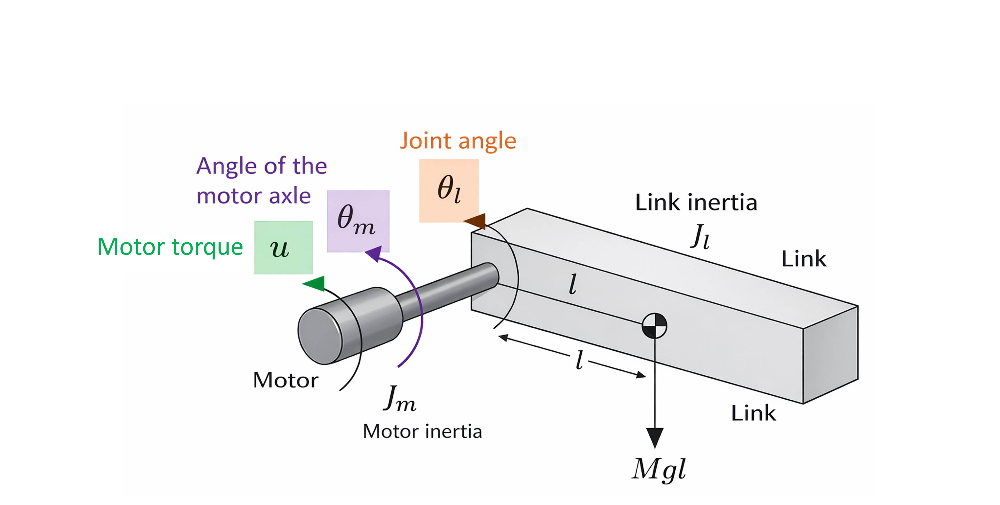
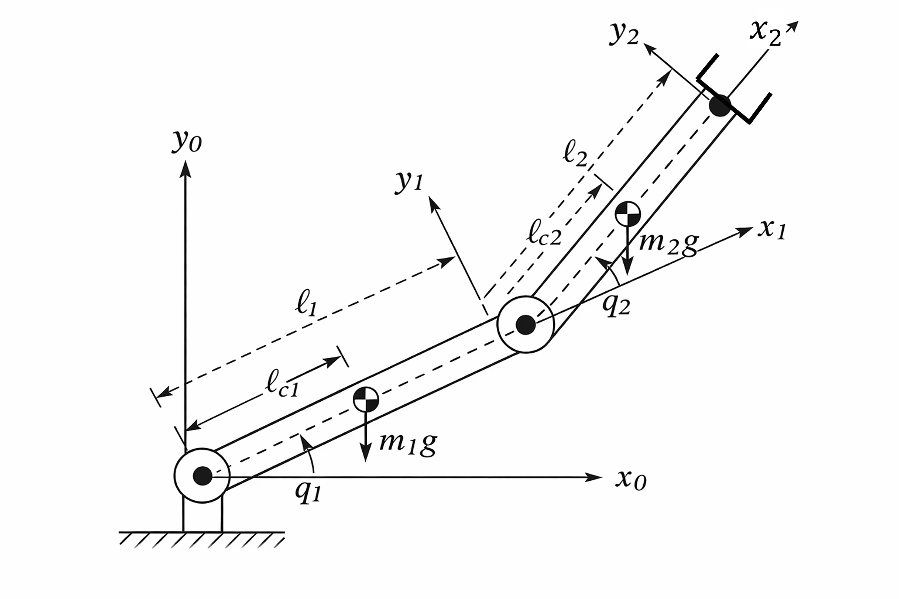
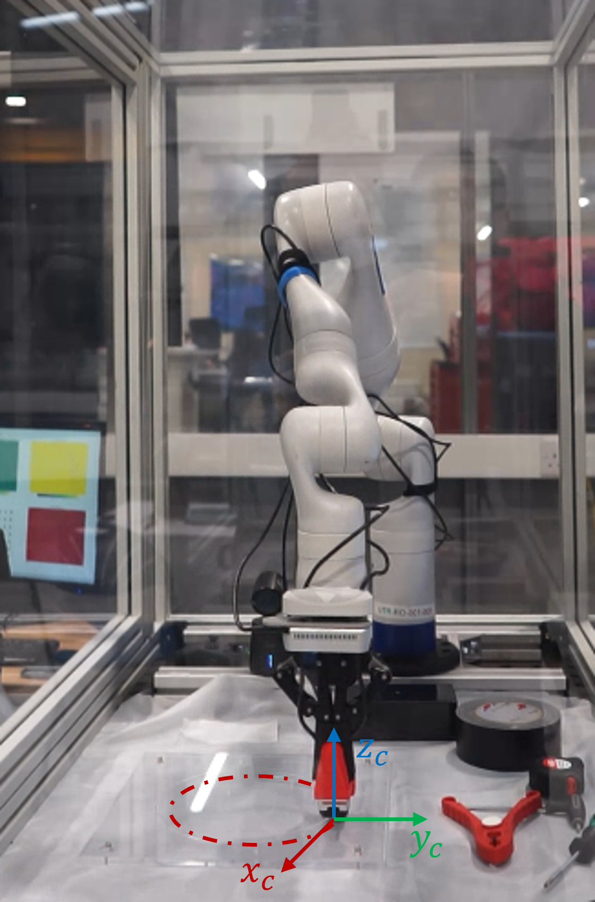

# Robotics Manipulators: 10-Week Coursework Execution Report

This document presents the complete terminal execution outputs for all 10 weekly continuous assessment notebooks in this repository, followed by a detailed catalog and engineering description of all image figures found in the coursework folders.

---

## 📋 Table of Contents
1. [Part 1: Weekly Terminal Execution Outputs](#part-1-weekly-terminal-execution-outputs)
   - [Week 1: Foundations of Linear Algebra](#week-1-foundations-of-linear-algebra)
   - [Week 2: Spatial Descriptions and Transformations](#week-2-spatial-descriptions-and-transformations)
   - [Week 3: Forward Kinematics](#week-3-forward-kinematics)
   - [Week 4: Differential Kinematics & Jacobians](#week-4-differential-kinematics--jacobians)
   - [Week 5: Jacobian Analysis & Singularities](#week-5-jacobian-analysis--singularities)
   - [Week 6: Introduction to Dynamics (Single-Link Arm)](#week-6-introduction-to-dynamics-single-link-arm)
   - [Week 7: Multi-DoF Manipulator Dynamics](#week-7-multi-dof-manipulator-dynamics)
   - [Week 8: Joint Space Control (PD & Inverse Dynamics)](#week-8-joint-space-control-pd--inverse-dynamics)
   - [Week 9: Task Space Control (Operational Space Dynamics)](#week-9-task-space-control-operational-space-dynamics)
   - [Week 10: Hybrid Force/Motion Control (Kinova Simulation)](#week-10-hybrid-forcemotion-control-kinova-simulation)
2. [Part 2: Coursework Figures Catalog & Descriptions](#part-2-coursework-figures-catalog--descriptions)
   - [Week 6 Figure: Single-Link Actuated Robotic Arm](#week-6-figure-single-link-actuated-robotic-arm)
   - [Week 7 Figure: 2-DoF Planar Manipulator Coordinate Frames](#week-7-figure-2-dof-planar-manipulator-coordinate-frames)
   - [Week 8 Figure: 2-DoF Planar Manipulator Diagram](#week-8-figure-2-dof-planar-manipulator-diagram)
   - [Week 9 Figure: 2-DoF Planar Manipulator Dynamics Schema](#week-9-figure-2-dof-planar-manipulator-dynamics-schema)
   - [Week 10 Figure: Kinova Gen3 7-DoF Manipulator Setup](#week-10-figure-kinova-gen3-7-dof-manipulator-setup)

---

## Part 1: Weekly Terminal Execution Outputs

All 10 weekly continuous assessment notebooks (`.ipynb`) were programmatically converted into isolated Python execution scripts, stripped of local IPython notebook commands (e.g., `%pip`, `%matplotlib inline`), and executed using a headless Matplotlib backend (`matplotlib.use('Agg')`) to capture raw console stdout, stderr, and tracebacks exactly as they run on a terminal.

### Week 1: Foundations of Linear Algebra
- **File Path**: `.\Week-01\lesson1_continuous_assessment.ipynb`
- **Focus**: Scalar, vector, and matrix algebra using `numpy`.
- **Terminal Output**:
```text
[No output produced]
```
> *Note: This notebook ran successfully with a 0 return code. It defines variables and checks mathematical identities inline without producing standard stdout or console prints.*

---

### Week 2: Spatial Descriptions and Transformations
- **File Path**: `.\Week-02\lesson2_continuous_assessment.ipynb`
- **Focus**: Application of special groups ($SO(2)$, $SE(2)$, $SO(3)$, and $SE(3)$) and composition of homogenous transform matrices.
- **Terminal Output**:
```text
The value 45 in degrees is 0.7853981633974483 in radians.
[[ 0.8660254  -0.5         0.        ]
 [ 0.3213938   0.5566704   0.76604444]
 [-0.38302222 -0.66341395  0.64278761]]
[[ 0.87758256 -0.47942554  0.          0.5       ]
 [ 0.47942554  0.87758256  0.          4.5       ]
 [ 0.          0.          1.         -1.5       ]
 [ 0.          0.          0.          1.        ]]
```

---

### Week 3: Forward Kinematics
- **File Path**: `.\Week-03\lesson3_continuous_assessment.ipynb`
- **Focus**: Translating joint space parameters to task space coordinates.
- **Terminal Output**:
```text
The value 45 in degrees is 0.7853981633974483 in radians.
[[-0.08715574  0.86272992 -0.49809735 -0.02614672]
 [-0.9961947  -0.07547909  0.04357787 -0.29885841]
 [ 0.          0.5         0.8660254   0.8       ]
 [ 0.          0.          0.          1.        ]]
[[-9.55336489e-01  1.80953938e-17 -2.95520207e-01 -4.77668245e-01]
 [-2.95520207e-01 -5.84974887e-17  9.55336489e-01 -1.47760103e-01]
 [ 0.00000000e+00  1.00000000e+00  6.12323400e-17  4.00000000e-01]
 [ 0.00000000e+00  0.00000000e+00  0.00000000e+00  1.00000000e+00]]
```

---

### Week 4: Differential Kinematics & Jacobians
- **File Path**: `.\Week-04\lesson4_continuous_assessment.ipynb`
- **Focus**: Linear and angular velocity mapping using Jacobians.
- **Terminal Output**:
```text
The value 45 in degrees is 0.7853981633974483 in radians.
[[ 0.61283555  0.64278761]
 [ 0.51423009 -0.76604444]
 [ 1.          0.        ]]
J_B =
 [[-0.98480775 -0.        ]
 [ 1.17364818  1.        ]
 [ 1.          1.        ]]
x_dot_B = [-0.09848078  0.41736482  0.4       ]
```

---

### Week 5: Jacobian Analysis & Singularities
- **File Path**: `.\Week-05\lesson5_continuous_assessment.ipynb`
- **Focus**: Inverse velocity, manipulability, and tracking Cartesian trajectories.
- **Terminal Output**:
```text
The value 45 in degrees is 0.7853981633974483 in radians.
xd = [0.3        0.2        1.04719755]
```
> *Note: Matplotlib plotting warnings (`FigureCanvasAgg is non-interactive, and thus cannot be shown`) were successfully handled as the plots were generated headlessly.*

---

### Week 6: Introduction to Dynamics (Single-Link Arm)
- **File Path**: `.\Week-06\lesson07_continuous_assessment.ipynb`
- **Focus**: Kinetic/potential energy formulations, Lagrangian dynamics of a single-link arm.
- **Terminal Output**:
```text
The Lagrangian of this system at the initial position is -2.2049999999999996
```

---

### Week 7: Multi-DoF Manipulator Dynamics
- **File Path**: `.\Week-07\lesson08_continuous_assessment.ipynb`
- **Focus**: Formulating inertia matrices ($D$), Coriolis effects ($C$), and gravity loading ($G$) for a 2-DoF planar manipulator.
- **Terminal Output**:
```text
[[0.69818341 0.2055182 ]
 [0.2055182  0.087038  ]]
```

---

### Week 8: Joint Space Control (PD & Inverse Dynamics)
- **File Path**: `.\Week-08\lesson09_continuous_assessment.ipynb`
- **Focus**: Joint-space feedback control including PD with gravity compensation and inverse dynamics controllers.
- **Terminal Output (Execution Log)**:
```text
Traceback (most recent call last):
  File "temp_run.py", line 273, in <module>
    D = Inertial_Matrix(q[i, 0], q[i, 1], model_parameters)
  File "temp_run.py", line 105, in Inertial_Matrix
    d22 = I2 + m2 * lc2**2    
TypeError: unsupported operand type(s) for ** or pow(): 'NoneType' and 'int'
```
> *Important Diagnostic*: This execution error occurs because the notebook `lesson09_continuous_assessment.ipynb` is an **uncompleted assessment template**. The model parameters (such as `m1`, `m2`, `lc2`, `I2`, etc.) and trajectory inputs are set to placeholder `None` values in the notebook's initial configuration cells (Lines 110–125), which triggers a `TypeError` when the simulation loop attempts arithmetic operations.

---

### Week 9: Task Space Control (Operational Space Dynamics)
- **File Path**: `.\Week-09\lesson10_continuous_assessment.ipynb`
- **Focus**: Formulating task-space dynamics and implementing task-space inverse dynamics controllers to track Cartesian trajectories.
- **Terminal Output**:
```text
Accumulated error in x: 0.010101186441316239
Accumulated error in y: 0.009886048749216284
```

---

### Week 10: Hybrid Force/Motion Control (Kinova Simulation)
- **File Path**: `.\Week-10\lesson11_continuous_assessment.ipynb`
- **Focus**: Contact-rich task execution, selection matrices for force vs. position control.
- **Terminal Output**:
```text
Joint-space force control input:
[ 3.174e+00  1.054e+00 -3.000e-03  2.108e+00  1.039e+00 -3.300e-02
 -2.400e-02]
```

---

## Part 2: Coursework Figures Catalog & Descriptions

Below is the structured registry of all mechanical engineering diagrams and experimental setup images found within the weeks' folders, complete with image names, relative paths, rendered images, and technical descriptions.

### Week 6 Figure: Single-Link Actuated Robotic Arm
- **Image Name**: `figure.png`
- **Relative Path**: `Week-06/figures/figure.png`
- **Workspace Image**:
  

#### 📝 Description:
This is a clean, 3D mechanical schematic illustrating a **single-link robotic manipulator** actuated by a rotary motor. It defines the coordinates and parameters essential for dynamics modeling:
- **Actuator (Motor)**: Positioned on the left, shown as a gray cylinder representing the drive motor. It carries a designated motor rotor inertia $J_m$.
- **Control Variables**:
  - **Motor Torque ($u$)**: Marked in green with a curved arrow indicating the rotational input torque applied by the actuator.
  - **Motor Axle Angle ($\theta_m$)**: Highlighted in purple, representing the angular position of the motor's shaft prior to the joint interface.
- **Manipulator Joint**:
  - **Joint Angle ($\theta_l$)**: Highlighted in light orange with a curved rotation arc, representing the actual angular displacement of the link.
- **Robotic Link**:
  - Shown as a gray rectangular bar of length $l$. Its total link inertia about the joint is denoted by $J_l$.
  - **Gravitational Load**: Originates from the center of mass (the checkered circular quadrant symbol) located at a distance of $l$ from the pivot. The vertical gravity force vector is labeled $Mgl$ (mass $\times$ gravity $\times$ length).

---

### Week 7 Figure: 2-DoF Planar Manipulator Coordinate Frames
- **Image Name**: `figure1.png`
- **Relative Path**: `Week-07/figures/figure1.png`
- **Workspace Image**:
  

#### 📝 Description:
This technical schematic outlines a **2-DoF (Degrees of Freedom) Planar Manipulator** equipped with two revolute joints operating in a 2D plane. It showcases the Denavit-Hartenberg (D-H) style reference frames and mechanical dimensions required for multi-link kinematics and dynamics:
- **Kinematic Base**: The arm is anchored to a fixed base with hatching lines at the bottom left.
- **Coordinate Reference Frames**:
  - **Base Frame ($x_0, y_0$)**: Situated at the first joint. The $y_0$-axis points vertically upward, and the $x_0$-axis points horizontally to the right.
  - **Link 1 Frame ($x_1, y_1$)**: Attached to the second joint. The $x_1$-axis is collinear with the longitudinal axis of Link 1, and $y_1$ is perpendicular to it.
  - **End-Effector Frame ($x_2, y_2$)**: Placed at the tip of Link 2. The $x_2$-axis is collinear with Link 2, and $y_2$ is orthogonal to it.
- **Joint Displacement Angles**:
  - **$q_1$**: The angular position of Joint 1, measured relative to the horizontal $x_0$-axis.
  - **$q_2$**: The angular position of Joint 2, measured relative to the extended axis of Link 1 ($x_1$-axis).
- **Physical Link Properties**:
  - **Link 1**: Has a total physical length of $l_1$. Its center of mass (marked by a circular quadrant symbol) is located at distance $l_{c1}$ from the base joint. The gravitational force vector $m_1 g$ points vertically downward from this center of mass.
  - **Link 2**: Has a total physical length of $l_2$. Its center of mass is located at distance $l_{c2}$ from the second joint. The gravitational force vector $m_2 g$ points vertically downward.
- **End-Effector**: The tip of Link 2 is equipped with a black claw-like schematic gripper.

---

### Week 8 Figure: 2-DoF Planar Manipulator Diagram
- **Image Name**: `figure1.png`
- **Relative Path**: `Week-08/figures/figure1.png`
- **Workspace Image**:
  

#### 📝 Description:
This image is **identical** in composition, labels, and visual content to the 2-DoF planar manipulator diagram in `Week-07/figures/figure1.png`. It serves as the primary visual reference for the joint-space control tasks, defining the joint variables ($q_1, q_2$), link lengths ($l_1, l_2$), center of mass offsets ($l_{c1}, l_{c2}$), and downward gravity loading ($m_1g, m_2g$) needed to implement the feedforward gravity compensation and inverse dynamics control laws.

---

### Week 9 Figure: 2-DoF Planar Manipulator Dynamics Schema
- **Image Name**: `figure1.png`
- **Relative Path**: `Week-09/figures/figure1.png`
- **Workspace Image**:
  

#### 📝 Description:
This image is also **identical** to the technical diagrams in `Week-07` and `Week-08`. In the context of Week 9's task-space control, it serves as the coordinate mapping base to translate joint variables $\mathbf{q} = [q_1, q_2]^T$ and velocities $\mathbf{\dot{q}}$ into Cartesian coordinates $\mathbf{x} = [x, y]^T$ at the gripper tip, facilitating the development of operational space dynamics and Cartesian impedance controllers.

---

### Week 10 Figure: Kinova Gen3 7-DoF Manipulator Setup
- **Image Name**: `figure_kinova.png`
- **Relative Path**: `Week-10/figures/figure_kinova.png`
- **Workspace Image**:
  

#### 📝 Description:
This is a high-resolution laboratory photograph capturing a physical robotic manipulation workspace set up for **contact-rich force-motion hybrid control experiments**:
- **Robotic Hardware**: A white-colored **Kinova Gen3 7-DoF (Degrees of Freedom) ultra-lightweight robotic manipulator** mounted vertically on a dark blue cylindrical riser.
- **Physical Environment**: The robot is enclosed inside a transparent safety chamber with structured aluminum vertical extrusions and safety acrylic panels.
- **Workspace Surface & End-Effector**:
  - The robotic manipulator's parallel gripper (fitted with bright red high-friction finger pads) is oriented vertically downward, in contact with a transparent acrylic plate placed on a white experimental table.
- **Coordinate Reference Frame Overlay**:
  - A task-space coordinate frame is overlaid at the point of contact on the acrylic sheet:
    - **$x_c$-axis (Red Arrow)**: Points forward and leftward, tangent to the contact plane.
    - **$y_c$-axis (Green Arrow)**: Points horizontally to the right along the contact plane.
    - **$z_c$-axis (Blue Arrow)**: Points vertically upward along the tool axis (normal to the contact surface).
- **Task Trajectory**: A red dashed-dotted ellipse is drawn on the acrylic sheet representing the circular or elliptical path the robot is commanded to trace while maintaining a target normal contact force along $z_c$.
- **Background Laboratory Elements**:
  - On the left, a computer screen displays vision-based tracking cards (with yellow, green, red, and blue quadrants).
  - On the right, manual tools sit on the table, including a red plastic spring clamp, a roll of black duct tape, a tape measure, and a screwdriver, indicating a dynamic lab workspace.
